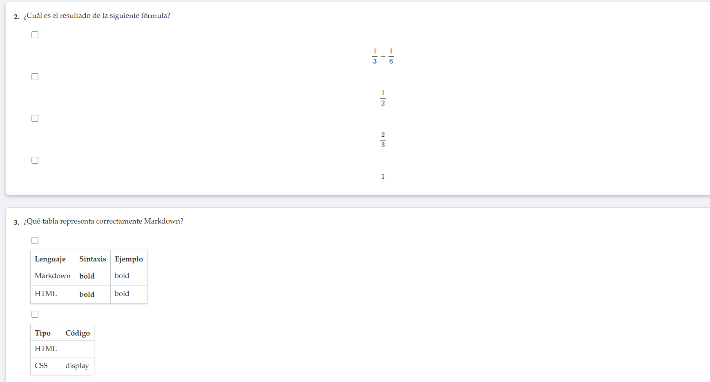
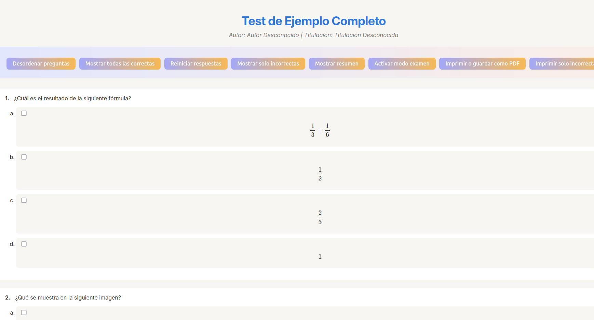
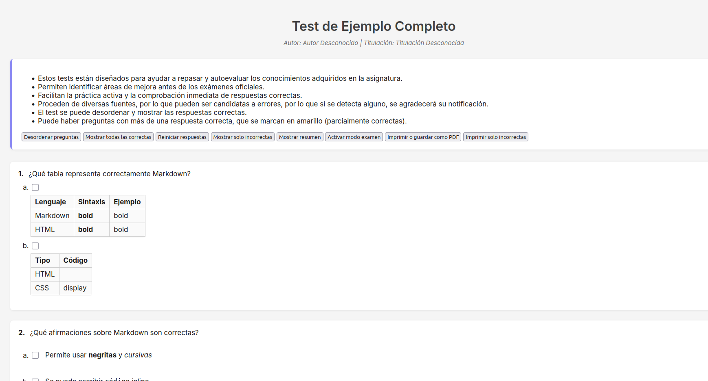
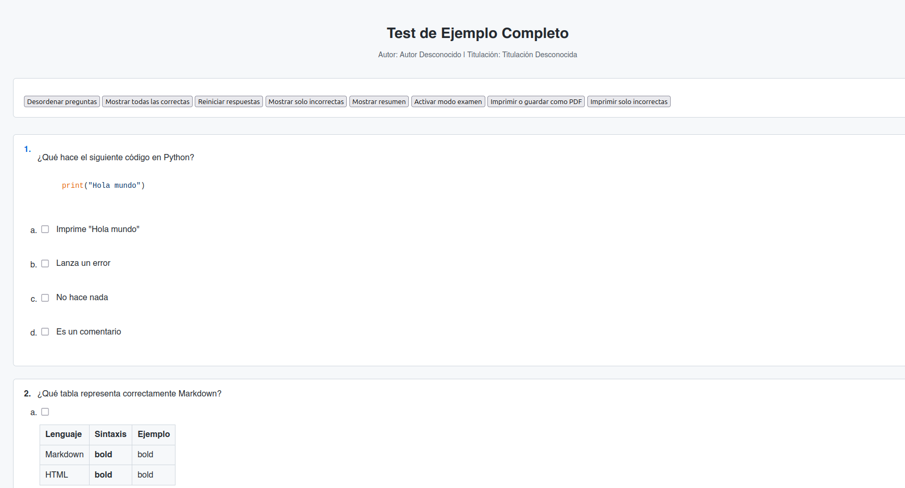
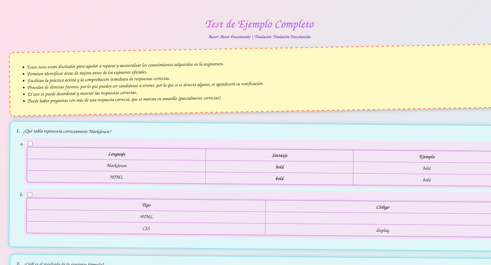

# MD2HTML 


Siendo estudiante viene bien hacer tipo test propias o ya sean copiadas de diversas plataformas para poder practicar de cara al examen, pero el hacer tipo test en formato `html` puede ser complicado ya que requiere de conocimiento previo sobre el código. Por ello os presento esta herramienta que es capaz de pasar texto plano a html para poder difundir esas preguntas para que las hagan las personas interesadas las veces que deseen,para profesores que quieren preparar a sus alumnos, profesores de Inglés para poner un ejercicio de listening o un video educativo y preguntarle luego sobre este y muchas otras opciones. 

## Como funciona

Su funcionamiento es muy simple, ya que esta diseñado para que el usuario no tenga que pensar mucho. `Es válido para usuarios tanto de Linux como de Windows.`

### Instalación y preparación del entorno

1. **Asegúrate de tener Python 3 instalado:**

    ```bash
    python3 --version
    ```

    Si no lo tienes, instálalo con:

    - **Ubuntu/Debian:**
      ```bash
      sudo apt update
      sudo apt install python3 python3-pip
      ```
    - **Windows:**  
      Descárgalo desde [python.org](https://www.python.org/downloads/)

2. **Módulo `markdown` (para convertir Markdown a HTML)**

    Instálalo con:
    ```bash
    pip install markdown
    ```

3. **Módulo `tkinter` (para la interfaz gráfica)**

    - En Windows, viene incluido con Python.
    - En Ubuntu/Debian, instálalo con:
      ```bash
      sudo apt install python3-tk
      ```
    - Si `import tkinter` falla, este paso es imprescindible.

4. **Opcional: codecs multimedia para reproducción local**

    Los navegadores reproducen audio y video directamente desde `<audio>` y `<video>`, pero si vas a abrir el HTML localmente, asegúrate de que los archivos `.mp3`, `.ogg`, `.mp4` estén correctamente codificados.  
    No necesitas instalar nada para eso si usas navegadores modernos como Chrome o Firefox.


Antes de ejecutar el `script` hay que tener en cuenta ciertos matices y características en cuanto a sintaxis y demás. En el ejemplo que viene en el repositorio `ejemploPreguntas.md` tenemos: 

```md
# Test de Ejemplo Completo

* **Autor:** Ismael Sallami Moreno
* **Descripción:** Este es un test de ejemplo que incluye todos los elementos compatibles.
* **Titulación:** Doble Grado en Ingeniería Informática y ADE

---

1. ¿Qué se muestra en la siguiente imagen?

    - (x) 
    - ( ) Un icono de Gmail
    - ( ) Un logo de Google Drive
    - ( ) Un sticker de Telegram

2. ¿Cuál es el resultado de la siguiente fórmula?

    - ( ) $$\frac{1}{3} + \frac{1}{6}$$
    - (x) $$\frac{1}{2}$$
    - ( ) $$\frac{2}{3}$$
    - ( ) $$1$$

<!-- 3. ¿Qué código C++ imprime "Hola Mundo"? -->

    <!-- Para el código y tablas se recomienda poner (codesnap de code,...) -->


4. ¿Qué afirmaciones sobre Markdown son correctas?

    - (x) Permite usar **negritas** y *cursivas*
    - (x) Se puede escribir `código` inline
    - ( ) Requiere compilarse como C++
    - ( ) No permite insertar imágenes

<!-- Esto es un comentario que no debe verse -->


2. ¿Qué tabla representa correctamente Markdown?

- (x)
  | Lenguaje | Sintaxis   | Ejemplo |
  |----------|------------|---------|
  | Markdown | **bold**   | bold    |
  | HTML     | <b>bold</b>| bold    |

- ( )
  | Tipo | Código |
  |------|--------|
  | HTML | <div>  |
  | CSS  | display|


3. ¿Qué hace el siguiente código en Python?

    ```python
    print("Hola mundo")
    ```

    - (x) Imprime "Hola mundo"
    - ( ) Lanza un error
    - ( ) No hace nada
    - ( ) Es un comentario

4. 

- (x) Opción correcta
- ( ) Opción incorrecta

1. ¿Qué muestra este vídeo ?


- (x) Muestra una animación
- ( ) Es un audio
- ( ) Da error
- ( ) Está vacío


```

>Debemos de tener *mucho* cuidado con la indetación.

Viendo el ejemplo tenemos que:
- Para poner autor, titulación y demás debemos de poner:
```md
-  # Titulo del test
  - **Autor:** nombre
  - **Descripción:** descripción
  - **Titulación:** titulación
```

- Podemos insertar trozos de código usando para ello la sintaxis propia de Markdown.
- Podemos poner palabras en negrita usando **negrita**, *cursiva* o incluso código en línea `código`.
- Podemos insertar imágenes:  
```md
  
```
- Podemos insertar audio: 
```md

```

- Podemos insertar video: 
```md

```
> Las palabras *video* y *audio* son fijas para que el software lo reconozca y debemos de tener cuidado con **Autor:** y demás y ponerlo tal cual para evitar errores.

- Los comentarios no se ponen, por lo que podemos añadirlos para agregar claridad y explicaciones.
- Para las opciones debemos de poner:
```md
( ) opción no correcta
(x)opción correcta
```
>Importante dejar el espacio entre los paréntesis cuando la opción no es correcta.

- Podemos poner fórmulas:
```md
$$ \frac{3}{4} $$
```
> Para ello debemos de tener conocimiento en LaTeX, podemos acceder al enlace del [manual de LaTeX](https://manualdelatex.com/tutoriales/ecuaciones) para más información. *Importante usar las dos $$ en vez de $*.

- Podemos poner tablas siguiendo la sintaxis de Markdown. 

> Para aquellos que quieran familiarizarse más en profundidad con este lengauaje puede acceder a esta [guía](https://markdown.es/).

---
|En resumen, podemos crear un cuestionario con imágenes, videos, texto, audio, tablas, fórmulas. Bastante completo la verdad. |
---

## Ejecución

Una vez instalado y seguido todos los pasos expuestos en la parte de [Como funciona](#como-funciona), podemos ejecutar el comando para activar el entorno de python y acto seguido ejecutar el programa (debemos de estar en el directorio base clonado):

Clonamos el repositorio:

```bash
git clone https://github.com/Ismael-Sallami/md2html.git
```
Activamos el entorno de python:
```bash
source venv/bin/activate 
```
Y ya ejecutamos el software:

```bash
python3 md2html.py
```
Se abrirá una interfaz gráfica donde debemos de seleccionar:
1. Las preguntas en formato md.
2. La plantilla html.
3. Donde guardarlo y asignarle un nombre.
4. *Opcional* Podemos añadir una lista como parte de 'cosas a tener en cuenta', para ello cuando se nos haga la pregunta por parte del programa si queremos dicha lista tecleamos `s` y a continuación el nombre o ruta de la lista (debe de ser en formato txt), si no la queremos basta con introducir `n` cuando se nos haga la pregunta.

Se incluye un video de como hacerlo:

[Ver video de instrucciones](readmeFiles/indicaciones.webm)

## Plantillas

Se presentan varias plantillas, unas más coloridas que otras y con otras características, la más completa es la plantilla denominada `plantilla.html`.

Aquí se pude ver imágenes de las previsualizaciones (en la carpeta `/plantillas/ejemplos` se encuentran los ejemplos que al clonar se pueden visualizar en su navegador para una prueba más sólida):

[](https://github.com/ElblogdeIsmael/ElblogdeIsmael.github.io/blob/main/extraFiles/MD_TO_HTML/ejemplos/ejemplo1.html)
[](https://github.com/ElblogdeIsmael/ElblogdeIsmael.github.io/blob/main/extraFiles/MD_TO_HTML/ejemplos/ejemplo2.html)
[](https://github.com/ElblogdeIsmael/ElblogdeIsmael.github.io/blob/main/extraFiles/MD_TO_HTML/ejemplos/ejemplo3.html)
[](https://github.com/ElblogdeIsmael/ElblogdeIsmael.github.io/blob/main/extraFiles/MD_TO_HTML/ejemplos/ejemplo4.html)
[](https://github.com/ElblogdeIsmael/ElblogdeIsmael.github.io/blob/main/extraFiles/MD_TO_HTML/ejemplos/ejemplo5.html)
[](https://github.com/ElblogdeIsmael/ElblogdeIsmael.github.io/blob/main/extraFiles/MD_TO_HTML/ejemplos/ejemplo6.html)


## Consideraciones
- Debemos de tener mucho cuidado con la sintaxis.
- Si al colgar un vídeo la pregunta es muy grande, el tamaño el video disminuye.
- Si se necesita más plantillas o algo por el estilo se aconseja contactar conmigo mandando un correo [aquí](https://elblogdeismael.github.io/htmlFiles/contact.html). 

---

Espero que os sirva y que esta herramienta os facilite la creación de vuestros propios tests y materiales educativos. ¡Cualquier sugerencia es bienvenida!
Les sugiero conocer más de mí [aquí](https://ismael-sallami.github.io/).
